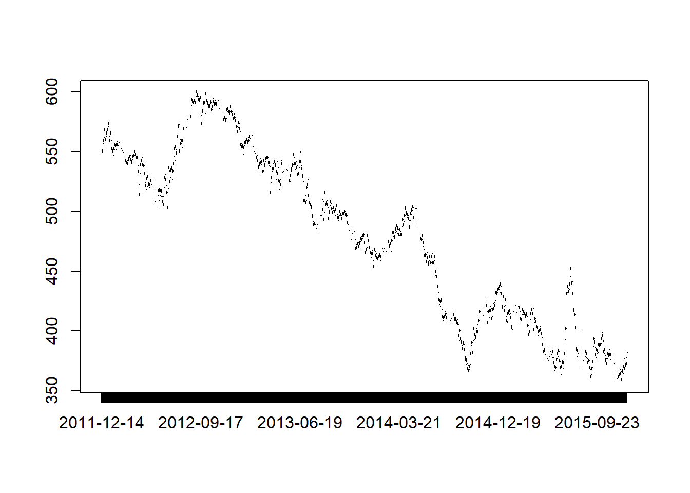

# Chapter 2: Getting Started

In Chapter 2 of *Price Analysis* we covered many sources for obtaining price and market fundamental data. In this chapter of the R companion, we will learn how to import these data in a variety of ways, including an API (application program interface) call. Using API's greatly reduce the work and time required to get up and running with an analysis, and more entities provide API access all the time. 

We will keep the introduction here to the bare minimum required to get us up and running and performing price analysis.   

## Data Import From Files on Your Hard Drive

Beginning analysis with R usually involves importing data from our hard drive. First we will download some data from [Quandl](Quandl.com).

Navigate to where [CZ2015](https://www.quandl.com/data/CME/CZ2015-Corn-Futures-December-2015-CZ2015) (December 2015 Corn future) is housed.


There is a button that says 'download' above the chart of the prices. When you click it, you will see file format options. We will work with CSV the most, but will learn how to import Excel files as well. We will not use json or XML file formats in this book.  

### From Comma Separated Files

Let's begin by loading the price data into R in the CSV format. Click the 'Download' button and then right-click 'CSV'. Choose 'Save Link As'. This gives you the ability to save it directly into your Chapter1 R project folder. If you click 'CSV' instead of right-click, the CSV file will automatically download into your 'Downloads' folder. This is OK, but you will need to go through the extra step of copy and pasting the CSV file into your Chapter1 project folder. 

Now we have the data on our hard drive, and we will load it into R for analysis! The `read.csv()` function looks for the file `CME-CZ2015.csv` in the working directory (file on your hard drive) and loads it into the R environment as a data.frame. In the "Environment" tab of the upper right pane of the RStudio console you should see the variable `CZ2015`. If you hover your mouse over it, RStudio will tell you that it is a data.frame-type variable and its size. 


```r
CZ2015 <- read.csv(file="CME-CZ2015.csv")

head(CZ2015)
```

```
##         Date   Open   High    Low   Last Change Settle Volume
## 1 2015-07-27 399.00 399.25 383.00 384.00  19.25 383.50 266575
## 2 2015-07-24 413.75 413.75 402.00 402.75  11.00 402.75 135131
## 3 2015-07-23 413.75 415.50 408.50 413.25   0.25 413.75 127893
## 4 2015-07-22 418.25 418.25 410.25 413.25   4.00 413.50 134747
## 5 2015-07-21 417.50 421.00 413.00 417.50   1.50 417.50 141530
## 6 2015-07-20 428.00 428.50 415.25 416.50  15.25 416.00 190950
##   Open.Interest
## 1        568270
## 2        568386
## 3        574043
## 4        572208
## 5        571192
## 6        557482
```

```r
tail(CZ2015)
```

```
##           Date Open  High Low Last Change Settle Volume Open.Interest
## 905 2011-12-21    0   0.0   0   NA     NA 567.75      0             8
## 906 2011-12-20    0   0.0   0   NA     NA 562.00      0             8
## 907 2011-12-19  555 555.0 555   NA     NA 559.00      1             7
## 908 2011-12-16    0   0.0   0   NA     NA 556.50      0             7
## 909 2011-12-15  545 549.5 545   NA     NA 550.25      7             0
## 910 2011-12-14    0   0.0   0   NA     NA 549.50      0             0
```


The `head()` function displays the first five rows of data and the `tail()` displays the last five rows. If you want to see more of the data you can click on the variable name in the *Environment* tab. You can see columns for *Date*, *Open*, *High*, *Low*, *Last*, *Change*, *Settle*, *Volume*, and *Open Interest*. *Open*, loosely defined, is the price the futures contract was trading at the open of the trading day. *High* and *Low* are the highest and lowest prices of the day respectively. *Last* is the price traded at the end of the trading day. *Settle* is the price determined by the exchange as the price against which accounts will be settled. This is usually very close to the last price, but the exchange uses a methodology to arrive at the settle price based on the price at which the contract was trading in the final moments of the trading day. If the close was volatile, as it often is, there can be some difference between the last price and the settle price. *Change* is the difference between today's *Settle* price and yesterday's *Settle* price. 

### From Microsoft Excel

It is best practice to always download your data as CSV files for the most flexibility possible. However, R does have the ability to read Microsoft Excel files, and it works very much like reading in CSV files. The function we need to do this does not come in the base R package that gets loaded when you install R. We need to *install* the package "xlsx" and load it into our *library*. Run the two lines of code below and we will be ready to use the `read.xlsx()` function from this package to load our `.xls` data file.  


```r
install.packages("xlsx")
library(xlsx)
```


Now that we have the proper package installed, using `read.xlsx()` is very similar to the `read.csv()` function we used before. The only addition is that since excel files can have multiple worksheets, we need to tell the function which worksheet to import. In our case the data file is simple with only one worksheet, so we just put a 1 in the second argument of the function. 


```r
 CZ2015 <- read.xlsx(file="CME-CZ2015.xls", 1)
```


## Working with API's

When a website has an API set of for their data warehouse, it is easy to import data into a programming environment with script. This saves a lot of time navigating and clicking through websites. Since we are learning to use R for price analysis, we will definitely want to make use of API calls when we can. We will need to install another package that provides functionality to extract information from webpages. Install the `RCurl` package and load the library by running the following code. 


```r
install.packages("RCurl")
library(RCurl)
```


### Quandl's API

In the previous sections we downloaded data from [Quandl.com](https://quandl.com) manually. They provide an API we can use to get their data directly into the R environment. To do this we will make use of the `getURL()` function from the `RCurl` package along with the `read.csv()` function we used earlier. Run the following code to download the December 2015 corn futures from [Quandl.com](https://quandl.com).


```r
CZ2015 <- getURL("https://www.quandl.com/api/v1/datasets/CME/CZ2015.csv")
CZ2015 <- read.csv(text = CZ2015)

head(CZ2015)
```

```
##         Date   Open   High    Low   Last Change Settle Volume
## 1 2015-12-14 373.50 381.75 373.50 381.00   8.75 381.75    903
## 2 2015-12-11 377.00 378.75 372.75 373.25   4.25 373.00   2028
## 3 2015-12-10 372.50 379.25 371.75 377.00   5.50 377.25   2543
## 4 2015-12-09 370.75 376.75 368.50 372.25   1.75 371.75   3217
## 5 2015-12-08 369.00 371.00 367.25 370.25   1.50 370.00   2947
## 6 2015-12-07 375.75 376.00 368.00 368.25   7.75 368.50   3271
##   Prev..Day.Open.Interest
## 1                     816
## 2                    2474
## 3                    4444
## 4                    6411
## 5                    7935
## 6                    9503
```


Note that this is the same data we manually downloaded before. To download a different data set, you just need to adjust the URL in the `getURL()` function to point to the right data set. Note the last two components of the URL, `CME` and `CZ2015.csv` match the "Quandl Code" in the top right corner of [Quandl.com](https://quandl.com).

For example, if you search on the [Quandl.com](https://quandl.com) webpage for `CME/SX2015` you can find the November 2015 CME soybeans futures contract and see that the "Quandl Code" for `SX2015` is `CME/SX2015`. Now if we adjust our API call above to point to November 2015 soybeans, we will have that data as well. 


```r
SX2015 <- getURL("https://www.quandl.com/api/v1/datasets/CME/SX2015.csv")
SX2015 <- read.csv(text = SX2015)

head(SX2015)
```

```
##         Date   Open   High    Low   Last Change Settle Volume
## 1 2015-11-13 871.75 871.75 860.50 860.50  10.25 859.00    110
## 2 2015-11-12 869.75 874.75 865.25 869.75   0.75 869.25    925
## 3 2015-11-11 865.75 869.75 863.50 868.50   4.00 868.50    763
## 4 2015-11-10 875.00 875.25 859.25 866.00   9.00 864.50   1241
## 5 2015-11-09 872.00 877.25 871.25 874.00   2.25 873.50   2312
## 6 2015-11-06 868.00 873.00 863.25 871.25   3.50 871.25   1327
##   Open.Interest
## 1            93
## 2           978
## 3          1997
## 4          3313
## 5          4324
## 6          5260
```


And now use the API call to get December 2015 soft red winter wheat futures. 


```r
WZ2015 <- getURL("https://www.quandl.com/api/v1/datasets/CME/WZ2015.csv")
WZ2015 <- read.csv(text = WZ2015)

head(WZ2015)
```

```
##         Date   Open   High    Low   Last Change Settle Volume
## 1 2015-12-14 488.00 490.50 488.00 488.75   5.00 487.75     15
## 2 2015-12-11 487.50 491.25 480.00 480.50   1.75 482.75     46
## 3 2015-12-10 478.50 487.75 476.75 487.75   6.50 484.50     32
## 4 2015-12-09 469.75 479.75 469.75 476.00   7.25 478.00     36
## 5 2015-12-08 471.00 471.75 466.50 470.25   0.50 470.75    134
## 6 2015-12-07 474.75 474.75 471.25 471.25   1.00 470.25    284
##   Open.Interest
## 1            15
## 2            67
## 3            86
## 4           174
## 5           382
## 6           346
```


### USDA API's

Some of the Services within the USDA provide API access to their data sets. The [USDA Open Data Catalog](http://www.usda.gov/wps/portal/usda/usdahome?navid=data) is a collection of all the publicly available USDA data sets. If you click on the links you will often just go to the web-front end of a query-able database. However, there are two links at the top of the webpage that say 'XML Version' and 'JSON Version'. These links are useful for accessing the API's that will either allow you to download data directly into the R environment or reveals the URL that will automatically download the data in .csv or other useful format that is easily then imported into the R environment.

<!-- Feedgrains database available here. Historical balance sheet categories-->
<!-- http://www.gipsa.usda.gov/fgis/exportgrain/CY2015.csv  URL format of GIPSA export inspections--> 

The URL to use the USDA NASS API for *Corn Ave Prices Received* is not as simple as the Quandl API above.[^documentation] 
To use the USDA API's you need to request and authentication code. This allows the USDA to keep track of who is accessing the data and make protect against attacks on the data servers. To request an API, click *obtain an API key* on the [http://quickstats.nass.usda.gov/api](http://quickstats.nass.usda.gov/api). Then enter the requested information. You will receive an email with the API key. The code below will download the *Average Prices Recieved by Farmers* for *Corn* in *Iowa* from *1970* to the present.  

[^documentation]: Documentation for the USDA NASS API can be found http://quickstats.nass.usda.gov/api. At this point, do not worry about understanding how to make sense of the documentation. This is simply a reference for your possible future use. I will provide all the correct URLs in the text. 
 


```r
IAPrice <- 'http://quickstats.nass.usda.gov/api/api_GET/?key=6E3544A2-95E5-3916-ACA4-8AAE9CA28130&commodity_desc=CORN&year__GE=1980&state_alpha=IA&format=CSV&statisticcat_desc=PRICE%20RECEIVED'
IAPrice <- read.csv(IAPrice)

head(IAPrice, 10)
```

```
##    source_desc sector_desc  group_desc commodity_desc  class_desc
## 1       SURVEY       CROPS FIELD CROPS           CORN ALL CLASSES
## 2       SURVEY       CROPS FIELD CROPS           CORN ALL CLASSES
## 3       SURVEY       CROPS FIELD CROPS           CORN ALL CLASSES
## 4       SURVEY       CROPS FIELD CROPS           CORN ALL CLASSES
## 5       SURVEY       CROPS FIELD CROPS           CORN ALL CLASSES
## 6       SURVEY       CROPS FIELD CROPS           CORN ALL CLASSES
## 7       SURVEY       CROPS FIELD CROPS           CORN ALL CLASSES
## 8       SURVEY       CROPS FIELD CROPS           CORN ALL CLASSES
## 9       SURVEY       CROPS FIELD CROPS           CORN ALL CLASSES
## 10      SURVEY       CROPS FIELD CROPS           CORN ALL CLASSES
##         prodn_practice_desc util_practice_desc statisticcat_desc unit_desc
## 1  ALL PRODUCTION PRACTICES              GRAIN    PRICE RECEIVED    $ / BU
## 2  ALL PRODUCTION PRACTICES              GRAIN    PRICE RECEIVED    $ / BU
## 3  ALL PRODUCTION PRACTICES              GRAIN    PRICE RECEIVED    $ / BU
## 4  ALL PRODUCTION PRACTICES              GRAIN    PRICE RECEIVED    $ / BU
## 5  ALL PRODUCTION PRACTICES              GRAIN    PRICE RECEIVED    $ / BU
## 6  ALL PRODUCTION PRACTICES              GRAIN    PRICE RECEIVED    $ / BU
## 7  ALL PRODUCTION PRACTICES              GRAIN    PRICE RECEIVED    $ / BU
## 8  ALL PRODUCTION PRACTICES              GRAIN    PRICE RECEIVED    $ / BU
## 9  ALL PRODUCTION PRACTICES              GRAIN    PRICE RECEIVED    $ / BU
## 10 ALL PRODUCTION PRACTICES              GRAIN    PRICE RECEIVED    $ / BU
##                                          short_desc domain_desc
## 1  CORN, GRAIN - PRICE RECEIVED, MEASURED IN $ / BU       TOTAL
## 2  CORN, GRAIN - PRICE RECEIVED, MEASURED IN $ / BU       TOTAL
## 3  CORN, GRAIN - PRICE RECEIVED, MEASURED IN $ / BU       TOTAL
## 4  CORN, GRAIN - PRICE RECEIVED, MEASURED IN $ / BU       TOTAL
## 5  CORN, GRAIN - PRICE RECEIVED, MEASURED IN $ / BU       TOTAL
## 6  CORN, GRAIN - PRICE RECEIVED, MEASURED IN $ / BU       TOTAL
## 7  CORN, GRAIN - PRICE RECEIVED, MEASURED IN $ / BU       TOTAL
## 8  CORN, GRAIN - PRICE RECEIVED, MEASURED IN $ / BU       TOTAL
## 9  CORN, GRAIN - PRICE RECEIVED, MEASURED IN $ / BU       TOTAL
## 10 CORN, GRAIN - PRICE RECEIVED, MEASURED IN $ / BU       TOTAL
##    domaincat_desc agg_level_desc state_ansi state_fips_code state_alpha
## 1   NOT SPECIFIED          STATE         19              19          IA
## 2   NOT SPECIFIED          STATE         19              19          IA
## 3   NOT SPECIFIED          STATE         19              19          IA
## 4   NOT SPECIFIED          STATE         19              19          IA
## 5   NOT SPECIFIED          STATE         19              19          IA
## 6   NOT SPECIFIED          STATE         19              19          IA
## 7   NOT SPECIFIED          STATE         19              19          IA
## 8   NOT SPECIFIED          STATE         19              19          IA
## 9   NOT SPECIFIED          STATE         19              19          IA
## 10  NOT SPECIFIED          STATE         19              19          IA
##    state_name asd_code asd_desc county_ansi county_code county_name
## 1        IOWA       NA       NA          NA          NA          NA
## 2        IOWA       NA       NA          NA          NA          NA
## 3        IOWA       NA       NA          NA          NA          NA
## 4        IOWA       NA       NA          NA          NA          NA
## 5        IOWA       NA       NA          NA          NA          NA
## 6        IOWA       NA       NA          NA          NA          NA
## 7        IOWA       NA       NA          NA          NA          NA
## 8        IOWA       NA       NA          NA          NA          NA
## 9        IOWA       NA       NA          NA          NA          NA
## 10       IOWA       NA       NA          NA          NA          NA
##    region_desc zip_5 watershed_code watershed_desc congr_district_code
## 1           NA    NA              0             NA                  NA
## 2           NA    NA              0             NA                  NA
## 3           NA    NA              0             NA                  NA
## 4           NA    NA              0             NA                  NA
## 5           NA    NA              0             NA                  NA
## 6           NA    NA              0             NA                  NA
## 7           NA    NA              0             NA                  NA
## 8           NA    NA              0             NA                  NA
## 9           NA    NA              0             NA                  NA
## 10          NA    NA              0             NA                  NA
##    country_code  country_name location_desc year freq_desc begin_code
## 1          9000 UNITED STATES          IOWA 2017   MONTHLY          1
## 2          9000 UNITED STATES          IOWA 2017   MONTHLY          2
## 3          9000 UNITED STATES          IOWA 2017   MONTHLY          3
## 4          9000 UNITED STATES          IOWA 2017   MONTHLY          4
## 5          9000 UNITED STATES          IOWA 2017   MONTHLY          5
## 6          9000 UNITED STATES          IOWA 2016    ANNUAL          0
## 7          9000 UNITED STATES          IOWA 2016   MONTHLY          1
## 8          9000 UNITED STATES          IOWA 2016   MONTHLY          2
## 9          9000 UNITED STATES          IOWA 2016   MONTHLY          3
## 10         9000 UNITED STATES          IOWA 2016   MONTHLY          4
##    end_code reference_period_desc week_ending           load_time Value
## 1         1                   JAN          NA 2017-03-30 15:00:16  3.34
## 2         2                   FEB          NA 2017-04-27 15:03:23  3.39
## 3         3                   MAR          NA 2017-05-31 15:00:03  3.43
## 4         4                   APR          NA 2017-06-29 15:05:42  3.34
## 5         5                   MAY          NA 2017-06-29 15:05:42  3.39
## 6         0        MARKETING YEAR          NA 2017-02-24 15:36:05  3.35
## 7         1                   JAN          NA 2017-02-28 15:05:23  3.55
## 8         2                   FEB          NA 2017-03-30 15:00:16  3.48
## 9         3                   MAR          NA 2017-04-27 15:03:23  3.46
## 10        4                   APR          NA 2017-05-31 15:00:03  3.52
##    CV....
## 1      NA
## 2      NA
## 3      NA
## 4      NA
## 5      NA
## 6      NA
## 7      NA
## 8      NA
## 9      NA
## 10     NA
```


Click on the *Environment* tab in RStudio and click `IAPrice` in the *Data* section. This will open up the data in RStudio's data viewer. This is not quite as functional as Microsoft Excel, but it is handy to verify what you downloaded looks as you expect it to. 


## Graphing Basics

The final topic we will cover in this chapter is basic plotting. Above, we already used `qplot()` from the `ggplot2` package to plot a frequency chart. The function below, `plot()`, comes installed with base R, so no need to install any packages before calling the function. We will plot the corn price data we imported previously in the chapter. It should be stored as a variable called `CZ2015`. We will plot the *Settle* prices over time. The `plot()` function takes to arguments. It needs a variable to plot along the x-axis and a variable to plot along the y-axis. We will put *Date* along the x-axis and *Settle* prices along the y-axis. 


```r
 library(RCurl)
CZ2015 <- getURL("https://www.quandl.com/api/v1/datasets/CME/CZ2015.csv")

plot(CZ2015$Dat, CZ2015$Settle)
```


```r
 library(RCurl)
CZ2015 <- getURL("https://www.quandl.com/api/v1/datasets/CME/CZ2015.csv")

plot(CZ2015$Date, CZ2015$Settle)
```



This plot is OK, but it is not exactly up to par when you think about what charts in finance, for example, usually look like. The `quantmod` package has become the most popular R package for charting. Go ahead and install it an load it into your library. 


```r
install.packages("quantmod")
install.packages("xts")
library(quantmod)
library(xts)
```

Now, lets plot December 2015 wheat prices that we imported earlier. To do this we will use the function `chartSeries()` from the `quantmod` package. It expects data to be a time series, and it expects to receive Open, High, Low, Close, and Volume.  


```r
library(quantmod)
WZ2015_chart <- subset(WZ2015, select= -c(Date, Change, Last, Open.Interest))      
WZ2015_chart <- xts(WZ2015_chart, order.by = as.Date(WZ2015$Date))    
colnames(WZ2015_chart)[4] <- "Close"    

chartSeries(WZ2015_chart['2015-01-01/'], type = "candlesticks", theme = chartTheme("white"))
```


There is a lot going on in this code chunk, actually. Let us go through the details, but what we just did is pretty advanced so do not feel overwhelmed. This was mostly to show you what is possible with financial data. To give you some perspective, it took me about an hour to search around and get the details right. 

The three first lines are all prepping the data to put it into the format the `chartSeries()` function expects. 

1. In the first line we removed the columns Date, Change, Last, Open.Interest because we need only Open, High, Low, Close. 
2. The second line does two things. It defines `WZ2015_chart` as an xts time series object, which is just a special class of object in R. It has attributes some functions written especially for time series data can utilize. The second argument of the `xts()` function uses `order.by` to indicate the `WZ2015$Date` variable should be used as the date index. and the `as.Date()` function puts the data in a proper format the `xts()` function recognizes. 
3. The third line changes the column named "Settle", which is the 4th column to "Close". This is because `chartSeries()` wants to see columns Open, High, Low, Close, and Volume. 


