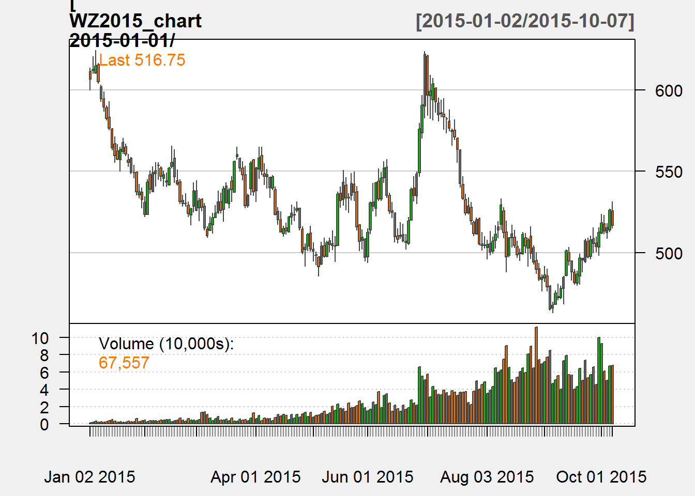

--- 
title: "R Companion to Price Analysis"
author: "Mindy L. Mallory"
description: "This book is a companion to 'Price Analysis: A Fundamental Approach to the Study of Commodity Prices'. It provides a basic introduction to working with commodity price and fundamental data from sources like Yahoo Finance, Quandl, and the USDA."
cover-image: "images/cover.png"
date: "`r Sys.Date()`"
site: bookdown::bookdown_site
documentclass: book
bibliography: [book.bib]
biblio-style: apalike
link-citations: yes
github-repo: mindymallory/R-Companion-Price-Analysis
url: 'http\:mindymallory.github.io/R-Companion-Price-Analysis/'
download:
      - ["book.pdf", "PDF"]
      - ["book.epub", "EPUB"]
---

# Preface {-}

