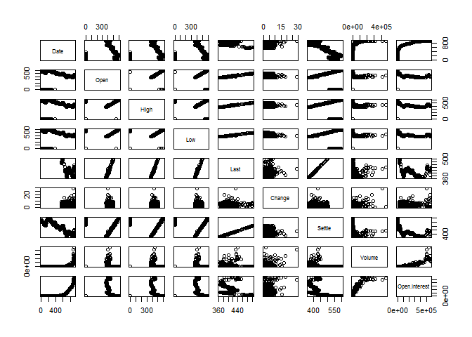

Chapter 2: Getting Started
==========================

In Chapter 2 of *Price Analysis* we covered many sources for obtaining
price and market fundamental data. In this chapter of the R companion,
we will learn how to import these data in a variety of ways, including
an api (application program interface) call. Using api's greatly reduce
the work and time required to get up and running with an analysis, and
more entities provide api access all the time.

We will keep the introduction here to the bare minimum required to get
us up and running and performing price analysis.

Data Import From Files on Your Hard Drive
-----------------------------------------

Beginning analysis with R usually involves importing data from our hard
drive. First we will download some data from [Quandl](Quandl.com).

Navigate to where
[CZ2015](https://www.quandl.com/data/CME/CZ2015-Corn-Futures-December-2015-CZ2015)
(December 2015 Corn future) is housed.

There is a button that says 'download' above the chart of the prices.
When you click it, you will see file format options. We will work with
CSV the most, but will learn how to import Excel files as well. We will
not use json or xml file formats in this book.

### From Comma Separated Files

Let's begin by loading the price data into R in the CSV format. Click
the 'Download' button and then right-click 'CSV'. Choose 'Save Link As'.
This gives you the ability to save it directly into your Chapter1 R
project folder. If you click 'CSV' instead of right-click, the CSV file
will automatically download into your 'Downloads' folder. This is ok,
but you will need to go through the extra step of copy and pasting the
CSV file into your Chapter1 project folder.

Now we have the data on our hard drive. Now we will load it into R for
analysis!

    >  CZ2015 <- read.csv(file="CME-CZ2015.csv")
    > 
    >  head(CZ2015)

    >         Date   Open   High    Low   Last Change Settle Volume
    > 1 2015-07-27 399.00 399.25 383.00 384.00  19.25 383.50 266575
    > 2 2015-07-24 413.75 413.75 402.00 402.75  11.00 402.75 135131
    > 3 2015-07-23 413.75 415.50 408.50 413.25   0.25 413.75 127893
    > 4 2015-07-22 418.25 418.25 410.25 413.25   4.00 413.50 134747
    > 5 2015-07-21 417.50 421.00 413.00 417.50   1.50 417.50 141530
    > 6 2015-07-20 428.00 428.50 415.25 416.50  15.25 416.00 190950
    >   Open.Interest
    > 1        568270
    > 2        568386
    > 3        574043
    > 4        572208
    > 5        571192
    > 6        557482

    >  tail(CZ2015)

    >           Date Open  High Low Last Change Settle Volume Open.Interest
    > 905 2011-12-21    0   0.0   0   NA     NA 567.75      0             8
    > 906 2011-12-20    0   0.0   0   NA     NA 562.00      0             8
    > 907 2011-12-19  555 555.0 555   NA     NA 559.00      1             7
    > 908 2011-12-16    0   0.0   0   NA     NA 556.50      0             7
    > 909 2011-12-15  545 549.5 545   NA     NA 550.25      7             0
    > 910 2011-12-14    0   0.0   0   NA     NA 549.50      0             0

      rnorm(10)

    ##  [1]  0.1406960 -0.7143946 -1.2274480  1.9524081 -1.1056627  0.4499572
    ##  [7]  1.4999425 -1.6383810  0.4785085  0.2664800

The head() function displays the first five rows of data and the tail()
displays the last five rows.

    plot(CZ2015)

### From Microsoft Excel

Working with API's
------------------

### Yahoo Finance's API

### USDA API's

Graphing Basics
---------------
