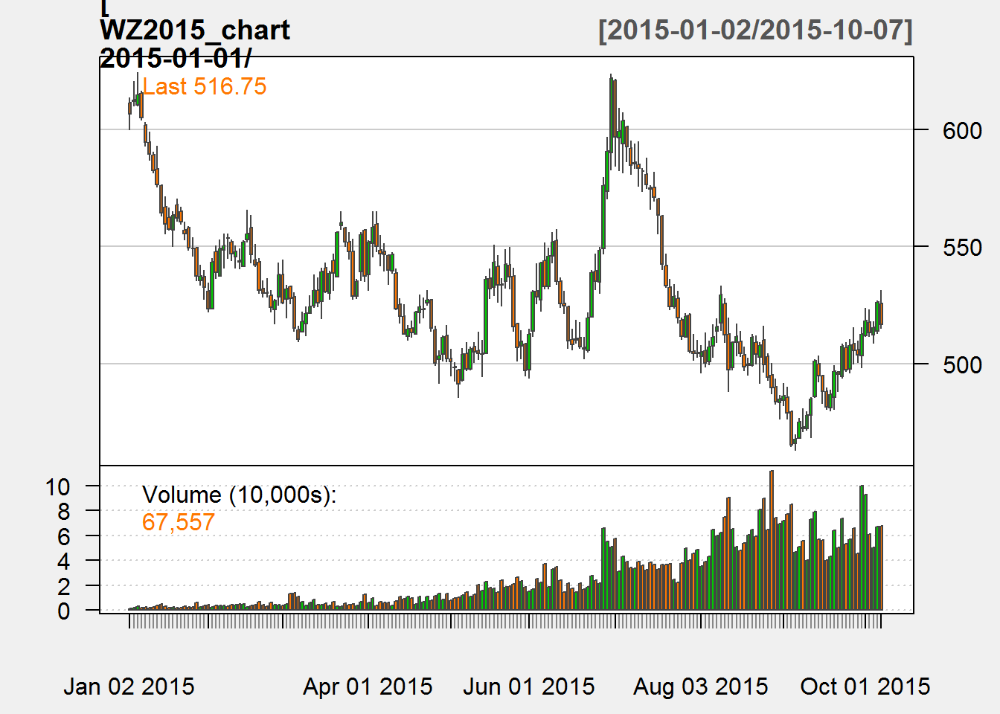

Chapter 2: Getting Started
==========================

In Chapter 2 of *Price Analysis* we covered many sources for obtaining
price and market fundamental data. In this chapter of the R companion,
we will learn how to import these data in a variety of ways, including
an api (application program interface) call. Using api's greatly reduce
the work and time required to get up and running with an analysis, and
more entities provide api access all the time.

We will keep the introduction here to the bare minimum required to get
us up and running and performing price analysis.

Data Import From Files on Your Hard Drive
-----------------------------------------

Beginning analysis with R usually involves importing data from our hard
drive. First we will download some data from [Quandl](Quandl.com).

Navigate to where
[CZ2015](https://www.quandl.com/data/CME/CZ2015-Corn-Futures-December-2015-CZ2015)
(December 2015 Corn future) is housed.

There is a button that says 'download' above the chart of the prices.
When you click it, you will see file format options. We will work with
CSV the most, but will learn how to import Excel files as well. We will
not use json or xml file formats in this book.

### From Comma Separated Files

Let's begin by loading the price data into R in the CSV format. Click
the 'Download' button and then right-click 'CSV'. Choose 'Save Link As'.
This gives you the ability to save it directly into your Chapter1 R
project folder. If you click 'CSV' instead of right-click, the CSV file
will automatically download into your 'Downloads' folder. This is ok,
but you will need to go through the extra step of copy and pasting the
CSV file into your Chapter1 project folder.

Now we have the data on our hard drive, and we will load it into R for
analysis! The `read.csv()` function looks for the file `CME-CZ2015.csv`
in the working directory (file on your hard drive) and loads it into the
R environment as a data.frame. In the "Environment" tab of the upper
right pane of the RStudio console you should see the variable `CZ2015`.
If you hover your mouse over it, RStudio will tell you that it is a
data.frame-type variable and its size.

{title="", linenos=off}  
~~~~~~~~

    CZ2015 <- read.csv(file="CME-CZ2015.csv")

    head(CZ2015)

    ##         Date   Open   High    Low   Last Change Settle Volume
    ## 1 2015-07-27 399.00 399.25 383.00 384.00  19.25 383.50 266575
    ## 2 2015-07-24 413.75 413.75 402.00 402.75  11.00 402.75 135131
    ## 3 2015-07-23 413.75 415.50 408.50 413.25   0.25 413.75 127893
    ## 4 2015-07-22 418.25 418.25 410.25 413.25   4.00 413.50 134747
    ## 5 2015-07-21 417.50 421.00 413.00 417.50   1.50 417.50 141530
    ## 6 2015-07-20 428.00 428.50 415.25 416.50  15.25 416.00 190950
    ##   Open.Interest
    ## 1        568270
    ## 2        568386
    ## 3        574043
    ## 4        572208
    ## 5        571192
    ## 6        557482

    tail(CZ2015)

    ##           Date Open  High Low Last Change Settle Volume Open.Interest
    ## 905 2011-12-21    0   0.0   0   NA     NA 567.75      0             8
    ## 906 2011-12-20    0   0.0   0   NA     NA 562.00      0             8
    ## 907 2011-12-19  555 555.0 555   NA     NA 559.00      1             7
    ## 908 2011-12-16    0   0.0   0   NA     NA 556.50      0             7
    ## 909 2011-12-15  545 549.5 545   NA     NA 550.25      7             0
    ## 910 2011-12-14    0   0.0   0   NA     NA 549.50      0             0

~~~~~~~~

The `head()` function displays the first five rows of data and the
`tail()` displays the last five rows. If you want to see more of the
data you can click on the variable name in the *Environment* tab. You
can see columns for *Date*, *Open*, *High*, *Low*, *Last*, *Change*,
*Settle*, *Volume*, and *Open Interest*. *Open*, loosely defined, is the
price the futures contract was trading at the open of the trading day.
*High* and *Low* are the highest and lowest prices of the day
respectively. *Last* is the price traded at the end of the trading day.
*Settle* is the price determined by the exchage as the price against
which accounts will be settled. This is usually very close to the last
price, but the exchange uses a methodology to arrive at the settle price
based on the price at which the contract was trading in the final
moments of the trading day. If the close was volatile, as it often is,
there can be some difference between the last price and the settle
price. *Change* is the difference between todays *Settle* price and
yesterday's *Settle* price.

### From Microsoft Excel

It is best practice to always download your data as CSV files for the
most flexibility possible. However, R does have the ability to read
Microsoft Excel files, and it works very much like reading in CSV files.
The function we need to do this does not come in the base R package that
gets loaded when you install R. We need to *install* the package "xlsx"
and load it into our *library*. Run the two lines of code below and we
will be ready to use the `read.xlsx()` function from this package to
load our `.xls` data file.

{title="", linenos=off}  
~~~~~~~~

    install.packages("xlsx")
    library(xlsx)

~~~~~~~~

Now that we have the proper package installed, using `read.xlsx()` is
very similar to the `read.csv()` function we used before. The only
addition is that since excel files can have multiple worksheets, we need
to tell the function which worksheet to import. In our case the data
file is simple with only one worksheet, so we just put a 1 in the second
argument of the function.

{title="", linenos=off}  
~~~~~~~~

     CZ2015 <- read.xlsx(file="CME-CZ2015.xls", 1)

~~~~~~~~

Working with API's
------------------

When a website has an API set of for thier data warehouse, it is easy to
import data into a programming environment with script. This saves a lot
of time navigating and clicking through websites. Since we are learning
to use R for price analysis, we will definitely want to make use of API
calls when we can. We will need to install another package that provides
functionality to extract information from webpages. Install the `RCurl`
package and load the library by running the following code.

~~~~~~~~

    install.packages("RCurl")
    library(RCurl)

~~~~~~~~

### Quandl's API

In the previous sections we downloaded data from
[Quandl.com](https://quandl.com) manually. They provide an API we can
use to get their data directly into the R environment. To do this we
will make use of the `getURL()` function from the `RCurl` package along
with the `read.csv()` function we used earlier. Run the following code
to download the December 2015 corn futures from
[Quandl.com](https://quandl.com).

~~~~~~~~

    CZ2015 <- getURL("https://www.quandl.com/api/v1/datasets/CME/CZ2015.csv")
    CZ2015 <- read.csv(text = CZ2015)

    head(CZ2015)

    ##         Date   Open   High    Low   Last Change Settle Volume
    ## 1 2015-08-03 380.00 380.50 374.50 378.75   4.75 376.50 131415
    ## 2 2015-07-31 385.00 387.75 379.25 381.25   2.50 381.25 147264
    ## 3 2015-07-30 378.25 385.00 375.75 385.00   5.50 383.75 177670
    ## 4 2015-07-29 387.75 388.00 377.25 377.50   7.25 378.25 144952
    ## 5 2015-07-28 383.75 386.25 380.25 386.00   2.00 385.50 160938
    ## 6 2015-07-27 399.00 399.25 383.00 384.00  19.25 383.50 266575
    ##   Open.Interest
    ## 1        602431
    ## 2        592126
    ## 3        575663
    ## 4        573381
    ## 5        577113
    ## 6        568270

~~~~~~~~

Note that this is the same data we manually downloaded before. To
download a different dataset, you just need to adjust the url in the
`getURL()` function to point to the right dataset. Note the last two
components of the url, `CME` and `CZ2015.csv` match the "Quandl Code" in
the top right corner of [Quandl.com](https://quandl.com).

For example, if you search on the [Quandl.com](https://quandl.com)
webpage for `CME/SX2015` you can find the November 2015 CME soybeans
futures contract and see that the "Quandl Code" for `SX2015` is
`CME/SX2015`. Now if we ajust our API call above to point to November
2015 soybeans, we will have that data as well.

~~~~~~~~

    SX2015 <- getURL("https://www.quandl.com/api/v1/datasets/CME/SX2015.csv")
    SX2015 <- read.csv(text = SX2015)

    head(SX2015)

    ##         Date   Open   High    Low   Last Change Settle Volume
    ## 1 2015-08-03 938.25 942.25 926.25 937.25   4.75 935.50  97404
    ## 2 2015-07-31 951.75 952.50 938.00 939.50   9.75 940.25  88136
    ## 3 2015-07-30 943.00 957.00 942.75 951.50   6.75 950.00 101244
    ## 4 2015-07-29 947.00 954.75 940.75 943.50   1.50 943.25  98618
    ## 5 2015-07-28 935.50 948.75 935.00 946.00  11.50 944.75 110262
    ## 6 2015-07-27 960.00 960.00 931.75 935.00  31.75 933.25 148324
    ##   Open.Interest
    ## 1        355205
    ## 2        353259
    ## 3        344157
    ## 4        339565
    ## 5        346137
    ## 6        351599

~~~~~~~~

And now use the API call to get December 2015 soft red winter wheat
futures.

~~~~~~~~

    WZ2015 <- getURL("https://www.quandl.com/api/v1/datasets/CME/WZ2015.csv")
    WZ2015 <- read.csv(text = WZ2015)

    head(WZ2015)

    ##         Date   Open   High    Low   Last Change Settle Volume
    ## 1 2015-08-03 503.00 507.75 496.25 506.75   0.25 505.00  35281
    ## 2 2015-07-31 504.25 510.00 502.75 503.75   0.50 504.75  48802
    ## 3 2015-07-30 505.25 512.50 501.50 504.50   1.00 504.25  45608
    ## 4 2015-07-29 521.00 521.50 504.75 505.25  15.00 505.25  40265
    ## 5 2015-07-28 511.50 521.50 511.25 521.00   8.50 520.25  49435
    ## 6 2015-07-27 518.75 519.50 510.50 511.25   8.00 511.75  37667
    ##   Open.Interest
    ## 1        138304
    ## 2        133414
    ## 3        126497
    ## 4        125680
    ## 5        129055
    ## 6        127717

~~~~~~~~

### USDA API's

Some of the Services within the USDA provide API access to their
datasets. The URL for *Corn Ave Prices Received* is not as simple as the
Quandl API above. [1]

For the USDA API's you need to request and authentication code. This
allows the USDA to keep track of who is accessing the data and make
protect against attacks on the data servers. To request an API, click
*obtain an API key* on the
[<http://quickstats.nass.usda.gov/api>](http://quickstats.nass.usda.gov/api).
Then enter the requested information. You will receive an email with the
API key. The code below will download the *Average Prices Recieved by
Farmers* for *Corn* in *Iowa* from *1970* to the present.

~~~~~~~~

    IAPrice <- getURL("http://quickstats.nass.usda.gov/api/api_GET/?key=6E3544A2-95E5-3916-ACA4-8AAE9CA28130&commodity_desc=CORN&year__GE=1980&state_alpha=IA&format=CSV&statisticcat_desc=PRICE%20RECEIVED")
    IAPrice <- read.csv(text = IAPrice)

    head(IAPrice, 10)

    ##    source_desc sector_desc  group_desc commodity_desc  class_desc
    ## 1       SURVEY       CROPS FIELD CROPS           CORN ALL CLASSES
    ## 2       SURVEY       CROPS FIELD CROPS           CORN ALL CLASSES
    ## 3       SURVEY       CROPS FIELD CROPS           CORN ALL CLASSES
    ## 4       SURVEY       CROPS FIELD CROPS           CORN ALL CLASSES
    ## 5       SURVEY       CROPS FIELD CROPS           CORN ALL CLASSES
    ## 6       SURVEY       CROPS FIELD CROPS           CORN ALL CLASSES
    ## 7       SURVEY       CROPS FIELD CROPS           CORN ALL CLASSES
    ## 8       SURVEY       CROPS FIELD CROPS           CORN ALL CLASSES
    ## 9       SURVEY       CROPS FIELD CROPS           CORN ALL CLASSES
    ## 10      SURVEY       CROPS FIELD CROPS           CORN ALL CLASSES
    ##         prodn_practice_desc util_practice_desc statisticcat_desc unit_desc
    ## 1  ALL PRODUCTION PRACTICES              GRAIN    PRICE RECEIVED    $ / BU
    ## 2  ALL PRODUCTION PRACTICES              GRAIN    PRICE RECEIVED    $ / BU
    ## 3  ALL PRODUCTION PRACTICES              GRAIN    PRICE RECEIVED    $ / BU
    ## 4  ALL PRODUCTION PRACTICES              GRAIN    PRICE RECEIVED    $ / BU
    ## 5  ALL PRODUCTION PRACTICES              GRAIN    PRICE RECEIVED    $ / BU
    ## 6  ALL PRODUCTION PRACTICES              GRAIN    PRICE RECEIVED    $ / BU
    ## 7  ALL PRODUCTION PRACTICES              GRAIN    PRICE RECEIVED    $ / BU
    ## 8  ALL PRODUCTION PRACTICES              GRAIN    PRICE RECEIVED    $ / BU
    ## 9  ALL PRODUCTION PRACTICES              GRAIN    PRICE RECEIVED    $ / BU
    ## 10 ALL PRODUCTION PRACTICES              GRAIN    PRICE RECEIVED    $ / BU
    ##                                          short_desc domain_desc
    ## 1  CORN, GRAIN - PRICE RECEIVED, MEASURED IN $ / BU       TOTAL
    ## 2  CORN, GRAIN - PRICE RECEIVED, MEASURED IN $ / BU       TOTAL
    ## 3  CORN, GRAIN - PRICE RECEIVED, MEASURED IN $ / BU       TOTAL
    ## 4  CORN, GRAIN - PRICE RECEIVED, MEASURED IN $ / BU       TOTAL
    ## 5  CORN, GRAIN - PRICE RECEIVED, MEASURED IN $ / BU       TOTAL
    ## 6  CORN, GRAIN - PRICE RECEIVED, MEASURED IN $ / BU       TOTAL
    ## 7  CORN, GRAIN - PRICE RECEIVED, MEASURED IN $ / BU       TOTAL
    ## 8  CORN, GRAIN - PRICE RECEIVED, MEASURED IN $ / BU       TOTAL
    ## 9  CORN, GRAIN - PRICE RECEIVED, MEASURED IN $ / BU       TOTAL
    ## 10 CORN, GRAIN - PRICE RECEIVED, MEASURED IN $ / BU       TOTAL
    ##    domaincat_desc agg_level_desc state_ansi state_fips_code state_alpha
    ## 1   NOT SPECIFIED          STATE         19              19          IA
    ## 2   NOT SPECIFIED          STATE         19              19          IA
    ## 3   NOT SPECIFIED          STATE         19              19          IA
    ## 4   NOT SPECIFIED          STATE         19              19          IA
    ## 5   NOT SPECIFIED          STATE         19              19          IA
    ## 6   NOT SPECIFIED          STATE         19              19          IA
    ## 7   NOT SPECIFIED          STATE         19              19          IA
    ## 8   NOT SPECIFIED          STATE         19              19          IA
    ## 9   NOT SPECIFIED          STATE         19              19          IA
    ## 10  NOT SPECIFIED          STATE         19              19          IA
    ##    state_name asd_code asd_desc county_ansi county_code county_name
    ## 1        IOWA       NA       NA          NA          NA          NA
    ## 2        IOWA       NA       NA          NA          NA          NA
    ## 3        IOWA       NA       NA          NA          NA          NA
    ## 4        IOWA       NA       NA          NA          NA          NA
    ## 5        IOWA       NA       NA          NA          NA          NA
    ## 6        IOWA       NA       NA          NA          NA          NA
    ## 7        IOWA       NA       NA          NA          NA          NA
    ## 8        IOWA       NA       NA          NA          NA          NA
    ## 9        IOWA       NA       NA          NA          NA          NA
    ## 10       IOWA       NA       NA          NA          NA          NA
    ##    region_desc zip_5 watershed_code watershed_desc congr_district_code
    ## 1           NA    NA              0             NA                  NA
    ## 2           NA    NA              0             NA                  NA
    ## 3           NA    NA              0             NA                  NA
    ## 4           NA    NA              0             NA                  NA
    ## 5           NA    NA              0             NA                  NA
    ## 6           NA    NA              0             NA                  NA
    ## 7           NA    NA              0             NA                  NA
    ## 8           NA    NA              0             NA                  NA
    ## 9           NA    NA              0             NA                  NA
    ## 10          NA    NA              0             NA                  NA
    ##    country_code  country_name location_desc year freq_desc begin_code
    ## 1          9000 UNITED STATES          IOWA 2015   MONTHLY          1
    ## 2          9000 UNITED STATES          IOWA 2015   MONTHLY          2
    ## 3          9000 UNITED STATES          IOWA 2015   MONTHLY          3
    ## 4          9000 UNITED STATES          IOWA 2015   MONTHLY          4
    ## 5          9000 UNITED STATES          IOWA 2015   MONTHLY          5
    ## 6          9000 UNITED STATES          IOWA 2015   MONTHLY          6
    ## 7          9000 UNITED STATES          IOWA 2014    ANNUAL          0
    ## 8          9000 UNITED STATES          IOWA 2014   MONTHLY          1
    ## 9          9000 UNITED STATES          IOWA 2014   MONTHLY          2
    ## 10         9000 UNITED STATES          IOWA 2014   MONTHLY          3
    ##    end_code reference_period_desc week_ending           load_time Value
    ## 1         1                   JAN          NA 2015-03-30 15:05:33  3.85
    ## 2         2                   FEB          NA 2015-04-30 15:00:23  3.79
    ## 3         3                   MAR          NA 2015-05-28 15:04:02  3.83
    ## 4         4                   APR          NA 2015-06-29 15:00:16  3.74
    ## 5         5                   MAY          NA 2015-07-30 15:00:17  3.60
    ## 6         6                   JUN          NA 2015-07-30 15:00:17  3.56
    ## 7         0        MARKETING YEAR          NA 2015-02-25 16:30:07  3.70
    ## 8         1                   JAN          NA 2015-02-27 15:10:53  4.43
    ## 9         2                   FEB          NA 2015-03-30 15:05:33  4.43
    ## 10        3                   MAR          NA 2015-04-30 15:00:23  4.55
    ##    CV....
    ## 1      NA
    ## 2      NA
    ## 3      NA
    ## 4      NA
    ## 5      NA
    ## 6      NA
    ## 7      NA
    ## 8      NA
    ## 9      NA
    ## 10     NA

~~~~~~~~

Click on the *Environment* tab in RStudio and click `IAPrice` in the
*Data* section. This will open up the data in RStudio's data viewer.
This is not quite as functional as Microsoft Excel, but it is handy to
verify what you downloaded looks as you expect it to.

Graphing Basics
---------------

The final function we will cover in this chapter is basic plotting.
Above, we already used `qplot()` from the `ggplot2` package to plot a
frequency chart. The function below, `plot()`, comes installed with base
R, so no need to install any packages before calling the function. We
will plot the corn price data we imported previously in the chapter. It
should be stored as a variable called `CZ2015`. We will plot the
*Settle* prices over time. The `plot()` function takes to arguments. It
needs a variable to plot along the x-axis and a varaible to plot along
the y-axis. We will put *Date* along the x-axis and *Settle* prices
along the y-axis.

~~~~~~~~

     library(RCurl)
    CZ2015 <- getURL("https://www.quandl.com/api/v1/datasets/CME/CZ2015.csv")

    plot(CZ2015$Dat, CZ2015$Settle)

~~~~~~~~

     library(RCurl)
    CZ2015 <- getURL("https://www.quandl.com/api/v1/datasets/CME/CZ2015.csv")

    plot(CZ2015$Date, CZ2015$Settle)

This plot is ok, but it is not exactly up to par when you think about
what charts in finance, for example, usually look like. The `quantmod`
package has become the most popular R package for charting. Go ahead and
install it an load it into your library.

    install.packages("quantmod")
    install.packages("xts")
    library(quantmod)
    library(xts)

Now, lets plot December 2015 soybean prices that we imported earlier. To
do this we will use the function `chartSeries()` from the `quantmod`
package. It expects data to be a time series, and it expects to recieve
Open, High, Low, Close, and Volume.

~~~~~~~~

    library(quantmod)
    WZ2015_chart <- subset(WZ2015, select= -c(Date, Change, Last, Open.Interest))      
    WZ2015_chart <- xts(WZ2015_chart, order.by = as.Date(WZ2015$Date))    
    colnames(WZ2015_chart)[4] <- "Close"    

    chartSeries(WZ2015_chart['2015-01-01/'], type = "candlesticks", theme = chartTheme("white"))

~~~~~~~~

There is a lot going on in this code chunk, actually. Let us go through
the details, but what we just did is pretty advanced so do not feel
overwhelmed. This was mostly to show you what is possible with financial
data. To give you some perspective, it took me about an hour to search
around and get the details right.

The three first lines are all prepping the data to put it into the
format the `chartSeries()` function expects.

1.  In the first line we removed the columns Date, Change, Last,
    Open.Interest because we need only Open, High, Low, Close.
2.  The second line does two things. It defines `WZ2015_chart` as an xts
    time series object, which is just a special class of object in R. It
    has attributes some functions written especially for time series
    data can utilize. The second argument of the `xts()` function uses
    `order.by` to indicate the `WZ2015$Date` varaible should be used as
    the date index. and the `as.Date()` function puts the data in a
    proper format the `xts()` function recognizes.
3.  The third line changes the column named "Settle", which is the 4th
    column to "Close". This is becuase `chartSeries()` wants to see
    columns Open, High, Low, Close, and Volume.

[1] Documentation for the USDA NASS API can be found
<http://quickstats.nass.usda.gov/api>. At this point, do not worry about
understanding how to make sense of the documentation. This is simply a
reference for your possible future use. I will provide all the correct
URLs in the text.
