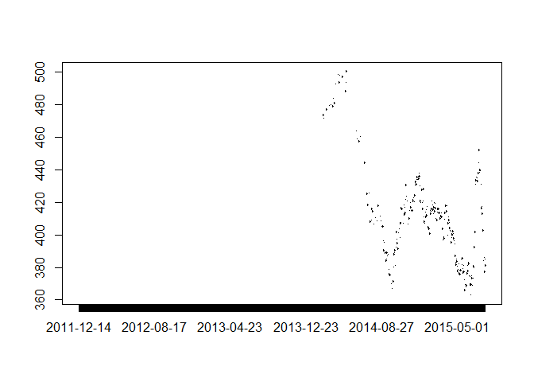

Chapter 2: Getting Started
==========================

In Chapter 2 of *Price Analysis* we covered many sources for obtaining
price and market fundamental data. In this chapter of the R companion,
we will learn how to import these data in a variety of ways, including
an api (application program interface) call. Using api's greatly reduce
the work and time required to get up and running with an analysis, and
more entities provide api access all the time.

We will keep the introduction here to the bare minimum required to get
us up and running and performing price analysis.

Data Import From Files on Your Hard Drive
-----------------------------------------

Beginning analysis with R usually involves importing data from our hard
drive. First we will download some data from [Quandl](Quandl.com).

Navigate to where
[CZ2015](https://www.quandl.com/data/CME/CZ2015-Corn-Futures-December-2015-CZ2015)
(December 2015 Corn future) is housed.

There is a button that says 'download' above the chart of the prices.
When you click it, you will see file format options. We will work with
CSV the most, but will learn how to import Excel files as well. We will
not use json or xml file formats in this book.

### From Comma Separated Files

Let's begin by loading the price data into R in the CSV format. Click
the 'Download' button and then right-click 'CSV'. Choose 'Save Link As'.
This gives you the ability to save it directly into your Chapter1 R
project folder. If you click 'CSV' instead of right-click, the CSV file
will automatically download into your 'Downloads' folder. This is ok,
but you will need to go through the extra step of copy and pasting the
CSV file into your Chapter1 project folder.

Now we have the data on our hard drive, and we will load it into R for
analysis! The `read.csv()` function looks for the file `CME-CZ2015.csv`
in the working directory (file on your hard drive) and loads it into the
R environment as a data.frame. In the "Environment" tab of the upper
right pane of the RStudio console you should see the variable `CZ2015`.
If you hover your mouse over it, RStudio will tell you that it is a
data.frame-type variable and its size.

{title="", linenos=off}  
~~~~~~~~

    CZ2015 <- read.csv(file="CME-CZ2015.csv")

    head(CZ2015)

    ##         Date   Open   High    Low   Last Change Settle Volume
    ## 1 2015-07-27 399.00 399.25 383.00 384.00  19.25 383.50 266575
    ## 2 2015-07-24 413.75 413.75 402.00 402.75  11.00 402.75 135131
    ## 3 2015-07-23 413.75 415.50 408.50 413.25   0.25 413.75 127893
    ## 4 2015-07-22 418.25 418.25 410.25 413.25   4.00 413.50 134747
    ## 5 2015-07-21 417.50 421.00 413.00 417.50   1.50 417.50 141530
    ## 6 2015-07-20 428.00 428.50 415.25 416.50  15.25 416.00 190950
    ##   Open.Interest
    ## 1        568270
    ## 2        568386
    ## 3        574043
    ## 4        572208
    ## 5        571192
    ## 6        557482

    tail(CZ2015)

    ##           Date Open  High Low Last Change Settle Volume Open.Interest
    ## 905 2011-12-21    0   0.0   0   NA     NA 567.75      0             8
    ## 906 2011-12-20    0   0.0   0   NA     NA 562.00      0             8
    ## 907 2011-12-19  555 555.0 555   NA     NA 559.00      1             7
    ## 908 2011-12-16    0   0.0   0   NA     NA 556.50      0             7
    ## 909 2011-12-15  545 549.5 545   NA     NA 550.25      7             0
    ## 910 2011-12-14    0   0.0   0   NA     NA 549.50      0             0

~~~~~~~~

The `head()` function displays the first five rows of data and the
`tail()` displays the last five rows.

### From Microsoft Excel

It is best practice to always download your data as CSV files for the
most flexibility possible. However, R does have the ability to read
Microsoft Excel files, and it works very much like reading in CSV files.
The function we need to do this does not come in the base R package that
gets loaded when you install R. We need to *install* the package "xlsx"
and load it into our *library*. Run the two lines of code below and we
will be ready to use the `read.xlsx()` function from this package to
load our `.xls` data file.

{title="", linenos=off}  
~~~~~~~~

    install.packages("xlsx")
    library(xlsx)

~~~~~~~~

Now that we have the proper package installed, using `read.xlsx()` is
very similar to the `read.csv()` function we used before. The only
addition is that since excel files can have multiple worksheets, we need
to tell the function which worksheet to import. In our case the data
file is simple with only one worksheet, so we just put a 1 in the second
argument of the function.

{title="", linenos=off}  
~~~~~~~~

     CZ2015 <- read.xlsx(file="CME-CZ2015.xls", 1)

~~~~~~~~

Working with API's
------------------

When a website has an API set of for thier data warehouse, it is easy to
import data into a programming environment with script. This saves a lot
of time navigating and clicking through websites. Since we are learning
to use R for price analysis, we will definitely want to make use of API
calls when we can. We will need to install another package that provides
functionality to extract information from webpages. Install the `RCurl`
package and load the library by running the following code.

~~~~~~~~

    install.packages("RCurl")
    library(RCurl)

~~~~~~~~

### Quandl's API

In the previous sections we downloaded data from
[Quandl.com](https://quandl.com) manually. They provide an API we can
use to get their data directly into the R environment. To do this we
will make use of the `getURL()` function from the `RCurl` package along
with the `read.csv()` function we used earlier. Run the following code
to download the December 2015 corn futures from
[Quandl.com](https://quandl.com).

~~~~~~~~

    CZ2015 <- getURL("https://www.quandl.com/api/v1/datasets/CME/CZ2015.csv")
    CZ2015 <- read.csv(text = CZ2015)

    head(CZ2015)

    ##         Date   Open   High    Low   Last Change Settle Volume
    ## 1 2015-07-31 385.00 387.75 379.25 381.25   2.50 381.25 147264
    ## 2 2015-07-30 378.25 385.00 375.75 385.00   5.50 383.75 177670
    ## 3 2015-07-29 387.75 388.00 377.25 377.50   7.25 378.25 144952
    ## 4 2015-07-28 383.75 386.25 380.25 386.00   2.00 385.50 160938
    ## 5 2015-07-27 399.00 399.25 383.00 384.00  19.25 383.50 266575
    ## 6 2015-07-24 413.75 413.75 402.00 402.75  11.00 402.75 135131
    ##   Open.Interest
    ## 1        592126
    ## 2        575663
    ## 3        573381
    ## 4        577113
    ## 5        568270
    ## 6        568386

~~~~~~~~

Note that this is the same data we manually downloaded before. To
download a different dataset, you just need to adjust the url in the
`getURL()` function to point to the right dataset. Note the last two
components of the url, `CME` and `CZ2015.csv` match the "Quandl Code" in
the top right corner of [Quandl.com](https://quandl.com).

For example, if you search on the [Quandl.com](https://quandl.com)
webpage for `CME/SX2015` you can find the November 2015 CME soybeans
futures contract and see that the "Quandl Code" for `SX2015` is
`CME/SX2015`. Now if we ajust our API call above to point to November
2015 soybeans, we will have that data as well.

~~~~~~~~

    SX2015 <- getURL("https://www.quandl.com/api/v1/datasets/CME/SX2015.csv")
    SX2015 <- read.csv(text = SX2015)

    head(SX2015)

    ##         Date   Open   High    Low  Last Change Settle Volume Open.Interest
    ## 1 2015-07-31 951.75 952.50 938.00 939.5   9.75 940.25  88136        353259
    ## 2 2015-07-30 943.00 957.00 942.75 951.5   6.75 950.00 101244        344157
    ## 3 2015-07-29 947.00 954.75 940.75 943.5   1.50 943.25  98618        339565
    ## 4 2015-07-28 935.50 948.75 935.00 946.0  11.50 944.75 110262        346137
    ## 5 2015-07-27 960.00 960.00 931.75 935.0  31.75 933.25 148324        351599
    ## 6 2015-07-24 980.25 982.25 963.25 968.0  15.50 965.00 101534        355249

~~~~~~~~

And now use the API call to get December 2015 soft red winter wheat
futures.

~~~~~~~~

    WZ2015 <- getURL("https://www.quandl.com/api/v1/datasets/CME/WZ2015.csv")
    WZ2015 <- read.csv(text = WZ2015)

    head(WZ2015)

    ##         Date   Open  High    Low   Last Change Settle Volume Open.Interest
    ## 1 2015-07-31 504.25 510.0 502.75 503.75    0.5 504.75  48802        133414
    ## 2 2015-07-30 505.25 512.5 501.50 504.50    1.0 504.25  45608        126497
    ## 3 2015-07-29 521.00 521.5 504.75 505.25   15.0 505.25  40265        125680
    ## 4 2015-07-28 511.50 521.5 511.25 521.00    8.5 520.25  49435        129055
    ## 5 2015-07-27 518.75 519.5 510.50 511.25    8.0 511.75  37667        127717
    ## 6 2015-07-24 527.75 531.0 517.50 520.00    9.0 519.75  22414        127312

~~~~~~~~

### USDA API's

Graphing Basics
---------------

{title="", linenos=off}  
~~~~~~~~

    plot(CZ2015$Dat, CZ2015$Last)

~~~~~~~~
